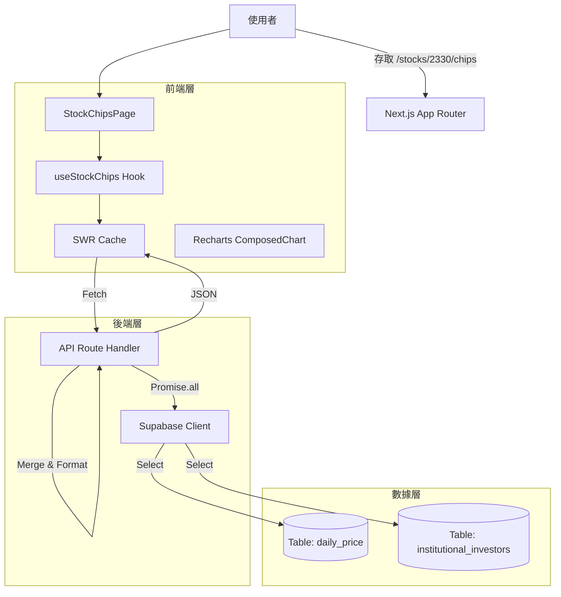

# 012_Phase4.5_Frontend_Audit_And_Chips_Review

**日期**: 2026-01-27
**階段**: Phase 4.5
**狀態**: ✅ Completed

---

## 📅 開發摘要 (Executive Summary)

本次任務針對 **Phase 4.3 籌碼分析 (Chips Analysis)** 與 **StockChart** 組件進行了深度審計 (Code Review) 與文件化。系統已成功整合 `lightweight-charts` v5 與 `Recharts`，實現了高效能的雙軸圖表渲染。

---

## 🕵️ 代碼審查報告 (Code Review Report)

### 1. K線圖組件 (`StockChart.tsx`)
- **評級**: A (Excellent)
- **優點**:
    - **架構優良**: 使用 `useRef` 正確管理 Chart Instance 生命周期，避免 Memory Leak。
    - **效能**: 透過 `useEffect` 依賴管理，僅在數據變更時重繪，且利用 Canvas 渲染優勢。
    - **API 適配**: 已完全遷移至 `lightweight-charts` v5 API (`createChart`, `addSeries`)。
- **優化建議**:
    - `handleResize` 目前依賴 `window.resize`。建議改用 `ResizeObserver` 監聽容器變動，以支援更靈活的佈局 (如 Sidebar 收合時)。

### 2. 籌碼分析頁 (`StockChipsPage.tsx`)
- **評級**: A- (Great)
- **優點**:
    - **UI 一致性**: 嚴格遵守 `GlassCard` 與 Glassmorphism 設計規範。
    - **視覺化**: `ComposedChart` 成功結合 Bar (三大法人) 與 Line (股價)，資訊密度高且清晰。
    - **防呆處理**: 各層級 (Loading, Empty, Error) 皆有完善的狀態展示。
- **注意事項**:
    - 日期格式目前使用 `slice(5)` 硬截取，建議後端統一回傳標準 ISO 格式或前端使用 `date-fns` 處理以防跨年問題。

### 3. 後端 API (`/api/stocks/[symbol]/chips`)
- **評級**: A (Secure & Efficient)
- **優點**:
    - **並行請求**: 採用 `Promise.all` 同時抓取 `daily_price` 與 `institutional_investors`，大幅降低延遲。
    - **記憶體運算**: 使用 `Map` 進行 O(N) 複雜度的數據合併 (Merge)，避免了複雜的 SQL Join 效能開銷。
    - **型別安全**: 對 DB 數值進行了嚴格的 `Number()` 轉換與 `|| 0` 預設值處理。

---

## 🏗️ 技術實作細節 (Implementation Details)

### 架構圖 (Architecture)

### 關鍵技術決策
1.  **混合圖表選型 (Recharts)**: 
    - 籌碼分析需要展示「量」(Bar) 與「價」(Line) 的關係，Recharts 的 `YAxisId` 多軸支援度最佳，且 SVG 渲染在交互上 (Tooltip) 優於 Canvas。
2.  **SWR 快取策略**:
    - 設定 `dedupingInterval: 60000` (1分鐘)，避免使用者在切換 Tab 時重複發送請求，減輕資料庫負擔。
3.  **Layout 隔離**:
    - 將 Header 與 Tab Navigation 抽離至 `layout.tsx`，確保切換子頁面時上方資訊不閃爍 (Persist Layout)。

---

## 📝 後續優化路徑 (Roadmap)

- [ ] **RWD 優化**: 手機版 `StockChart` 高度需自動調整。
- [ ] **互動增強**: 點擊 K 線圖特定日期，連動下方籌碼數據高亮顯示。
- [ ] **資料補全**: 補充融資融券 (Margin Trading) 數據至 API。
