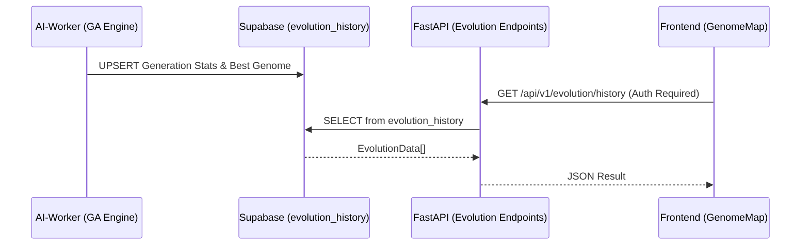

# 🏛️ Phase 13.3 架構審計報告 (Sys Architect Audit)

## 1. 方案評估：基因組存儲 (Genome Storage)

| 方案 | 技術實作 | 優點 | 缺點 | 推薦 |
|:---|:---|:---|:---|:---|
| **A: 向量陣列** | `float8[]` | 矩陣運算快、型別安全、存儲精簡 | Schema 較不具彈性 | ✅ 首選 |
| **B: JSONB** | `jsonb` | 基因位點可隨時擴展名稱 | 查詢效能稍低 (B-Tree 較重) | 備選 |

**審計結論**：由於演化引擎採用的 DEAP 框架以 `List[float]` 為核心，採用 **方案 A (float8[])** 可完美契合後端邏輯且具備最佳檢索速度。

## 2. 數據流與安全 (Data Flow & Security)

- **安全防護**：演化紀錄表必須配置 RLS，僅限 `authenticated` 讀取，防止策略參數洩漏。
- **效能緩存**：核心 API 端點應整合 Redis 緩存（TTL 60s），避免前端頻繁輪詢導致資料庫壓力。

---

## 3. 架構品質 Checkbox
- [x] 欄位命名符合 `snake_case` 規範
- [x] 資料庫 RLS 政策已包含在遷移腳本 (`20260212_evolution_history.sql`)
- [ ] 邊界錯誤處理：當代數不連續時的斷點視覺處理
