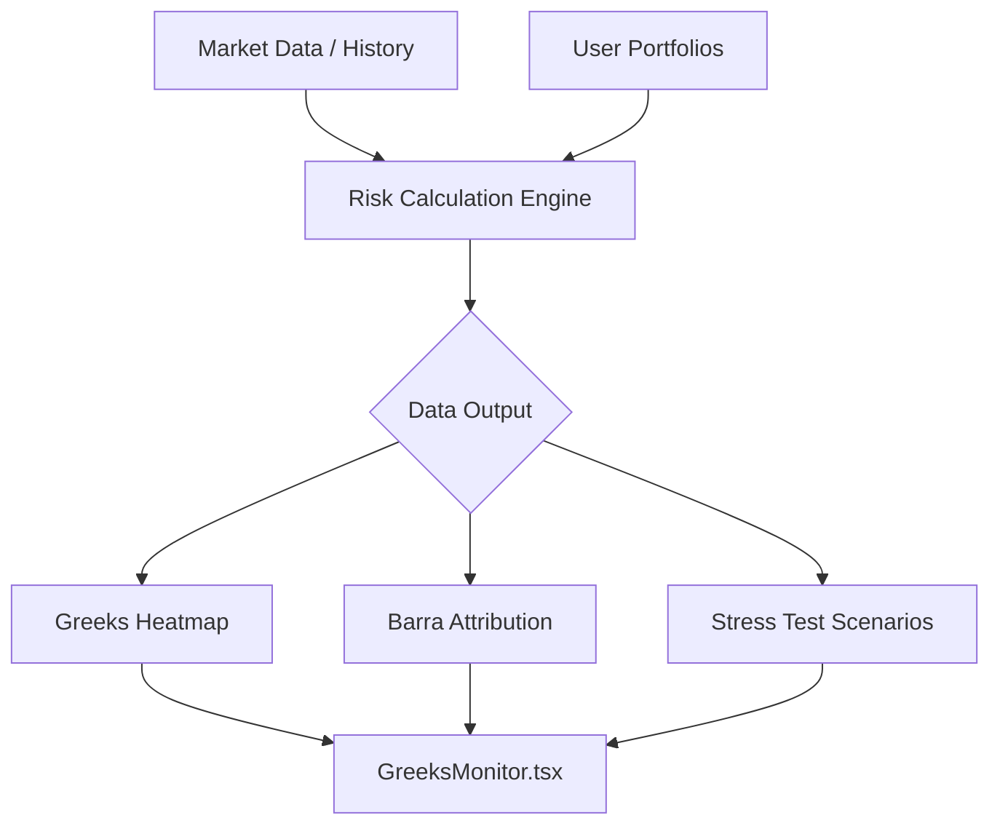

# 20260212_02_Risk_Matrix_Audit.md

# 🛡️ Phase 13.4: 法人級風險矩陣架構審計

## 1. 架構模型 (Mermaid)

## 2. 方案權衡 (Trade-off Analysis)

| 決策項 | 方案 A | 方案 B (採用) | 理由 |
|:---:|:---:|:---:|:---|
| **計算引擎** | 預先計算 (Batch) | 依需計算 (On-demand) | 風險敏感度隨價格實時變動，Batch 延遲高。 |
| **歸因方法** | 全量回歸運算 | 權重映射計算法 | 符合 KISS 原則，降低運算資源成本。 |
| **存儲策略** | 永久持久化 | 快取 (Redis) + 報告存檔 | 風險數據時效性短，通常只需保存快照。 |

## 3. 安全性審計 (Risk & Security)
- **數據完整性**：Barra 分解需依賴 `stock_factors`，需確保因子數據更新無誤。
- **邊界處理**：針對美股/台股不同波動特性，應調整壓力測試的百分比閾值。
- **隱私**：壓力測試涉及用戶「模擬持倉」，API 必須通過 JWT 與 RLS 保護。

## 4. 審計結論
架構符合 V10.0 高效能、高可視化要求。優先實作 `/professional/risk-matrix` 之基礎 Greeks 模擬功能。
