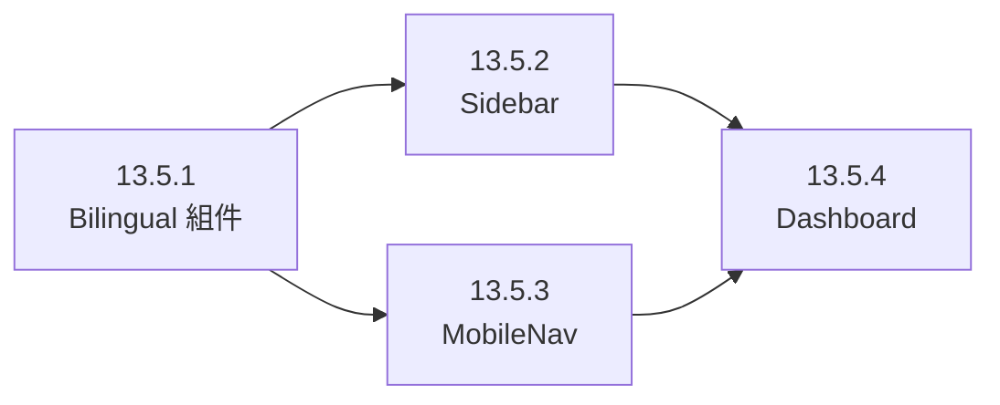

# Phase 13.5: 雙語 UI 介面轉型計畫 (Bilingual UI Transformation)

## 1. 需求解構 (Thinking Phase)

依照 V10.0 「Rich Aesthetics (豐富美學)」原則，單純的中文或英文介面在金融終端中顯得單薄。透過「**主體繁體中文 + 輔助小字英文**」的組合，可以大幅提升系統的「專業感 (Professionalism)」與「視覺深度 (Visual Depth)」。

- **核心目標**：全面重構前端文字，改採雙語對稱排版。
- **視覺規範**：
  - **中文**：主體字級，對應功能直覺。
  - **英文**：全大寫 (Uppercase)、縮小字級 (80%-60%)、增加字距 (Tracking-widest)、半透明度 (Opacity-50/70)。

### 1.1 現狀分析 (深度調研結果)

| 組件 | 現狀 | 問題根因 |
|:--|:--|:--|
| `Sidebar.tsx` | `label.split(' (')[0]` 切割中英文 | ⚠️ 脆弱字串操作，無型別安全 |
| `MobileNav.tsx` | 平面字串 `"總覽 (Overview)"` | ❌ 無視覺分離，專業感不足 |
| `page.tsx` | 標題純中文，圖表標題純英文 | ❌ 風格不統一，缺乏層次 |
| `GlassCard.tsx` | 純容器組件 | ✅ 無需變更 (KISS) |

### 1.2 方案對比 (Trade-off Analysis)

| 方案 | 優點 | 缺點 | 推薦 |
|:--|:--|:--|:--|
| A: 通用 `Bilingual` 組件 | 一次定義、處處覆用；型別安全；樣式收斂 | 需額外抽象層 | ✅ 推薦 |
| B: 各組件內聯雙語 | 零用抽象 | 重複代碼、風格不統一 | ❌ |

**結論**：方案 A — 遵循 DRY + KISS，建立一個輕量 `Bilingual` 組件。

---

## 2. UI/UX 實作方案 (/ui-ux-pro-max)

### 2.1 標準化組件：`Bilingual.tsx`

在 `frontend/components/ui/` 建立通用組件，支援三種排版模式。

```tsx
// API 設計
interface BilingualProps {
  zh: string;
  en: string;
  mode?: "stacked" | "inline" | "suffix";
  className?: string;
  zhClassName?: string;
  enClassName?: string;
}
```

### 2.2 不同場景的排版策略

| 場景 | 排版模式 | 視覺權重 |
|:---|:---|:---|
| **大標題 (H1/H2)** | Stacked (上下分層) | 中文 32px / 英文 12px (Bold) |
| **導航列 (Sidebar)** | Stacked (上下分層) | 中文 14px / 英文 8px (Mono) |
| **按鈕 (Button)** | Inline (左右同行) | 中文字後跟隨小字英文 |
| **圖表軸線 (Chart Labels)** | Suffix (括號後綴) | 範例：營收 (Revenue) |

---

## 3. 修改範圍全量審計

### 3.1 核心布局層 (Level 0) — 本次執行範圍

#### [NEW] `frontend/components/ui/Bilingual.tsx`
- 三模式通用組件 (stacked / inline / suffix)
- 型別安全的 `BilingualProps` 介面

#### [MODIFY] `frontend/components/layout/Sidebar.tsx`
- `MENU_ITEMS` 結構從 `label: string` → `{ zh, en }` 物件
- 移除脆弱 `label.split(' (')` 字串操作
- 導入 `Bilingual mode="stacked"`
- 底部 `系統設定` 同步更新

#### [MODIFY] `frontend/components/layout/MobileNav.tsx`
- `navItems` 結構從 `label: string` → `{ zh, en }` 物件
- `NavLink` 整合 `Bilingual mode="stacked"`
- Drawer Header `"選單 (Menu)"` 改為 Bilingual 排版

#### [MODIFY] `frontend/app/page.tsx`
- `市場導航儀` → `Bilingual zh="市場導航儀" en="Market Navigator"`
- `宏觀趨勢動態` → `Bilingual zh="宏觀趨勢動態" en="Macro Trends"`
- `智庫辯論報告` → `Bilingual zh="智庫辯論報告" en="AI Reports"`
- `系統效能中心` → `Bilingual zh="系統效能中心" en="System Health"`

### 3.2 關鍵頁面層 (Level 1) — 後續滲透
- [ ] `app/admin/monitor/page.tsx`: 表格標頭、狀態標籤
- [ ] `app/ai/strategy/page.tsx`: 戰術規劃器文字

### 3.3 資料展示組件 (Level 2) — 後續滲透
- [ ] `ScoreRadarChart.tsx`: 18 因子名稱雙語化
- [ ] `ProButton.tsx`: 全局按鈕預設支援雙語

---

## 4. 執行路徑 (Task Breakdown)



| 順序 | 任務 | 預估 | 依賴 |
|:--|:--|:--|:--|
| 1️⃣ | **13.5.1**: 開發 `Bilingual` 通用 UI 組件 | ~10 min | 無 |
| 2️⃣ | **13.5.2**: 重構 Sidebar 與全局 Layout 導航 | ~10 min | 13.5.1 |
| 3️⃣ | **13.5.3**: 重構 MobileNav 同步雙語視覺 | ~10 min | 13.5.1 |
| 4️⃣ | **13.5.4**: Dashboard 首頁標題雙語化 | ~10 min | 13.5.1 |
| 5️⃣ | **13.5.5**: 自動化測試 + TypeScript 檢查 | ~10 min | 13.5.1-4 |

---

## 5. Verification Plan

### 自動化測試
- `frontend/__tests__/ui/Bilingual.test.tsx`: 三種模式渲染正確性
- `frontend/__tests__/layout/Sidebar.test.tsx`: 導航項目雙語渲染
- TypeScript 型別檢查: `npx tsc --noEmit`

### 驗收標準
- Sidebar 與 MobileNav 視覺對照 (中文上 / 英文下)
- Dashboard 標題層次清晰
- RWD 響應式 375px / 768px / 1440px

---
**核准簽名**：AI 投資分析儀 UI/UX 創意總監
**日期**：2026-02-11
