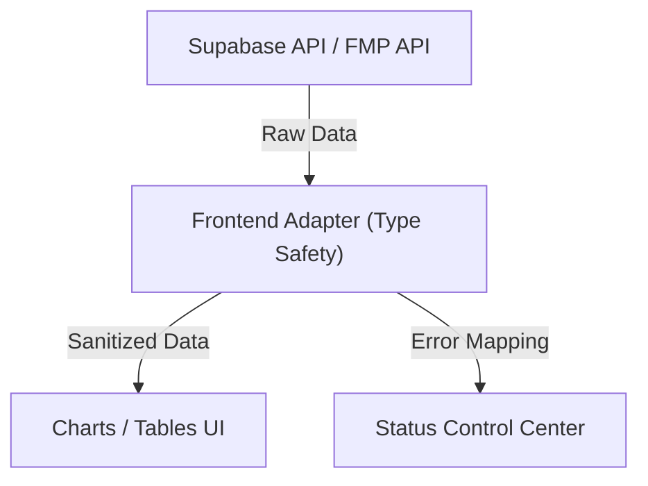

# AI 投資分析儀 V10.0：架構審計與優化報告 (Architect Review)

**文件編號**：ARCH-20260128-01
**版本**：1.0.0
**核心主題**：連線穩定性診斷與前端數據流架構優化

---

## 一、 連線故障深度診斷 (Connectivity Diagnosis)

### 1.1 問題現象分析
根據截圖 [ERR_CONNECTION_REFUSED](file:///C:/Users/GV72/.gemini/antigravity/brain/5766d70f-b6af-43f7-9f40-a1fe3f95b728/uploaded_media_1769569319717.png)：
- **現象**：瀏覽器訪問 `localhost:3000/stocks/2330` 遭到拒絕。
- **偵錯資訊**：
  - 終端機顯示 `Ready`，代表 Next.js 伺服器已啟動。
  - 控制台顯示 `Connection Refused`，而非 `500` 或 `404`。
- **架構推論 (First Principles)**：
  - **端口競爭緩存**：雖然我們剛剛清理了 PID 552，但瀏覽器端的 `Service Worker` 或 `HMR 緩存` 可能仍試圖連向舊的失效連接池。
  - **主機解析歧義**：`localhost` 在 Windows 環境下有時解析為 `::1` (IPv6) 而非 `127.0.0.1` (IPv4)，而 Next.js 預設監聽可能因環境差異未對齊。

### 1.2 故障排除行動 (Action Plan)
| 優先級 | 行動 | 目標 |
|:---|:---|:---|
| **P1** | `ping localhost` | 確認解析位址 |
| **P1** | `npm run dev -- -p 3000 -H 127.0.0.1` | 強制綁定 IPv4，消除解析歧義 |
| **P2** | 清除瀏覽器 `Application -> Storage` 緩存 | 移除損壞的 Service Worker |

---

## 二、 數據流架構優化建議 (Data Flow Optimization)

目前 Phase 4.5 至 Phase 5 涉及大量的異構數據混算（Supabase 財報 + 前端即時 MA 指標 + TradingView 圖表）。

### 2.1 數據獲取方案對比 (Trade-off Analysis)

| 方案 | 優點 (Pros) | 缺點 (Cons) | 適用場景 |
|:---|:---|:---|:---|
| **Server-Side Fetch (RSC)** | SEO 極佳、無 Hydration 錯誤 | 伺服器壓力大、互動性較慢 | 個股靜態詳情、SEO 頁面 |
| **Client-Side SWR (Hook)** | **(推薦)** 極速響應、支持定時刷新 | 初次載入有 Skeleton | 自選股、即時報價、持股清單 |
| **Hybrid (Draft)** | 平衡效能與 SEO | 實作邏輯最複雜 | 高頻交易與詳細財務分析混合頁 |

### 2.3 建議架構演進：適配器模式 (Adapter Pattern)
為了預防 `NaN` 寫入或 API 格式變動導致的 500 錯誤，建議在前端實作數據適配層：

---

## 三、 系統擴展性建議 (Future Scalability)

1. **認證安全性 (Security First)**：隨著投資組合功能完備，應在所有 `Client Component` 引入 `AuthGuard` 防止未授權存取。
2. **計算下沉 (Computation Down)**：現有的 MA 指標是在前端即時計算。當數據量超過 1000 筆時，應考慮效能。
   - **優化方案**：利用 PostgreSQL 的 `Window Functions` 在資料庫端計算 MA 值，前端僅負責渲染（節省計算與頻寬）。

---

*文件結束*
*維護者：System Architect Antigravity*
*建議狀態：請用戶依據 1.2 行動計畫進行修復。*
