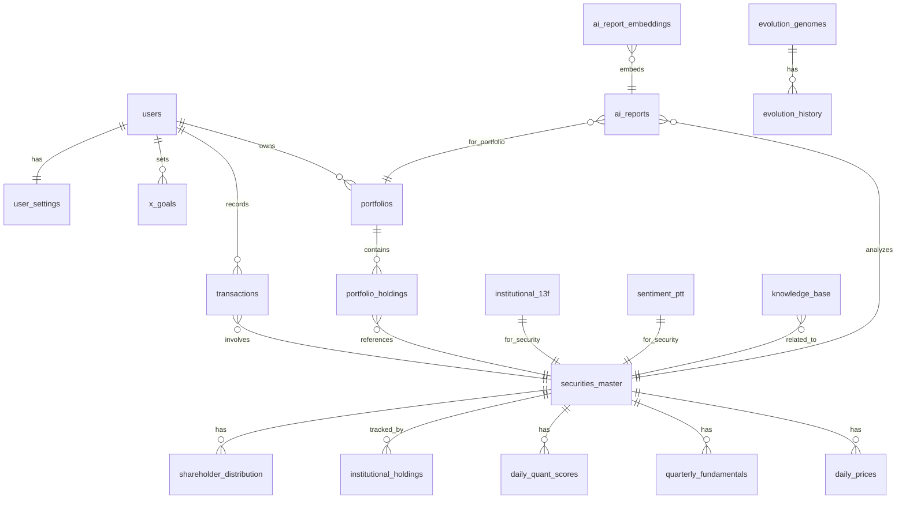

# 03. 資料庫設計與數據血緣 (Data Management & Database)

> **文件版本**：v1.0 (V10.0 完整規格書重構)
> **日期**：2026-02-10
> **核心使命**：定義完整的資料庫 Schema、PostgreSQL 15 + pgvector 配置、RLS 安全策略、索引優化與數據血緣追蹤，涵蓋 18 維度評分與演化策略基因組存儲

---

## 1. 資料庫設計哲學 (Database Philosophy)

V10.0 的資料庫設計不僅是存儲，更是**「數據品質的守門人」**。系統採用 PostgreSQL 15 作為核心資料庫，擴充 pgvector、pg_graphql、pg_net 等插件，提供完整的數據管理能力。

### 1.1 設計原則

| 原則 | 說明 | 實作方式 |
|------|------|----------|
| **基於時間序列 (Time-series Centric)** | 以時間為維度管理所有價格與分析指標 | 分區表、BRIN 索引 |
| **強關係與低冗餘** | 利用關聯式資料庫特性確保數據一致性 | Foreign Keys、Constraint |
| **安全性與多租戶潛力** | 透過 PostgreSQL RLS 防護每一筆敏感交易 | Row Level Security |
| **可擴展性** | 支援 pgvector 向量存儲與 AI 檢索 | pgvector Extension |
| **可追溯性** | 完整記錄數據來源、清洗過程與更新時間 | Data Lineage 欄位 |
| **演化策略支持** | 存儲 450 筆基因組與 26 個基因的演化歷史 | 專用表結構 |

### 1.2 V10.0 資料庫特性

| 特性 | V9.3 | V10.0 強化 |
|------|------|------------|
| **PostgreSQL 版本** | 16 | **15** (Stable) |
| **向量維度** | 768 (Gemini) | **768-1536** (多模型支援) |
| **資料表數量** | 20+ | **25+** (新增演化策略表) |
| **分區策略** | 年度分區 | **年度 + 季度分區** |
| **索引類型** | B-Tree, BRIN | **B-Tree, BRIN, IVFFlat** |

---

## 2. 完整實體關係圖 (Complete ERD)



---

## 3. 完整 Schema 定義 (25+ Tables)

### 3.1 Schema 結構

```sql
-- ============================================
-- V10.0 Schema 結構
-- ============================================

CREATE SCHEMA system;           -- 系統元數據
CREATE SCHEMA market_data;      -- 市場行情數據
CREATE SCHEMA analysis;         -- 分析結果數據
CREATE SCHEMA alternative;      -- 另類數據
CREATE SCHEMA user_data;        -- 用戶私密數據
CREATE SCHEMA evolution;        -- V10.0 演化策略數據
```

### 3.2 市場數據核心模組 (Market Data Core)

```sql
-- ============================================
-- 1. 市場數據核心模組 (Market Data Core)
-- ============================================

-- 1.1 證券主檔 (Securities Master)
CREATE TABLE market_data.securities_master (
    id              SERIAL PRIMARY KEY,
    ticker_symbol   VARCHAR(20) NOT NULL,
    exchange        VARCHAR(10) NOT NULL,  -- TWSE, TPEX, NYSE, NASDAQ, INDEX, FOREX
    asset_class     VARCHAR(20) NOT NULL,  -- stock, etf, bond, commodity, crypto
    name_zh         VARCHAR(100),
    name_en         VARCHAR(100),
    sector          VARCHAR(50),
    industry        VARCHAR(50),
    currency        VARCHAR(3) DEFAULT 'TWD',
    market_cap      NUMERIC(20, 2),        -- 市值 (用於回補優先級排序)
    is_active       BOOLEAN DEFAULT TRUE,
    cfi_code        VARCHAR(10),           -- ISO 10962 分類碼
    data_source     VARCHAR(20) DEFAULT 'mixed',
    created_at      TIMESTAMPTZ DEFAULT NOW(),
    updated_at      TIMESTAMPTZ DEFAULT NOW(),
    
    UNIQUE(ticker_symbol, exchange)
);

-- 索引
CREATE INDEX idx_securities_ticker ON market_data.securities_master(ticker_symbol);
CREATE INDEX idx_securities_exchange ON market_data.securities_master(exchange);
CREATE INDEX idx_securities_sector ON market_data.securities_master(sector);
CREATE INDEX idx_securities_market_cap ON market_data.securities_master(market_cap DESC);
CREATE INDEX idx_securities_active ON market_data.securities_master(is_active);

-- 1.2 每日價格 (Daily Prices) - 分區表
CREATE TABLE market_data.daily_prices (
    security_id     INTEGER NOT NULL REFERENCES market_data.securities_master(id),
    date            DATE NOT NULL,
    open            NUMERIC(19, 4),
    high            NUMERIC(19, 4),
    low             NUMERIC(19, 4),
    close           NUMERIC(19, 4) NOT NULL,
    volume          BIGINT,
    adj_close       NUMERIC(19, 4),
    source_api      VARCHAR(20),           -- tiingo, fugle, yfinance, twse
    is_backfilled   BOOLEAN DEFAULT FALSE,
    fetched_at      TIMESTAMPTZ DEFAULT NOW(),
    
    PRIMARY KEY (security_id, date)
) PARTITION BY RANGE (date);

-- 年度分區 (V10.0 擴充)
CREATE TABLE market_data.daily_prices_2023 PARTITION OF market_data.daily_prices
    FOR VALUES FROM ('2023-01-01') TO ('2024-01-01');
CREATE TABLE market_data.daily_prices_2024 PARTITION OF market_data.daily_prices
    FOR VALUES FROM ('2024-01-01') TO ('2025-01-01');
CREATE TABLE market_data.daily_prices_2025 PARTITION OF market_data.daily_prices
    FOR VALUES FROM ('2025-01-01') TO ('2026-01-01');
CREATE TABLE market_data.daily_prices_2026 PARTITION OF market_data.daily_prices
    FOR VALUES FROM ('2026-01-01') TO ('2027-01-01');

-- BRIN 索引 (針對時序數據極致優化)
CREATE INDEX idx_prices_date_brin ON market_data.daily_prices USING BRIN (date);
CREATE INDEX idx_prices_security_brin ON market_data.daily_prices USING BRIN (security_id);

-- 1.3 市場指數即時快照
CREATE TABLE market_data.market_indices_status (
    symbol          VARCHAR(20) PRIMARY KEY,  -- ^TWII, ^SOX, USD/TWD, GCK99, VIX
    price           NUMERIC(19, 4),
    change          NUMERIC(19, 4),
    change_percent  NUMERIC(19, 4),
    source          VARCHAR(10),              -- yf, gck99, twse
    updated_at      TIMESTAMPTZ DEFAULT NOW()
);

-- 1.4 V10.0 每日量化分數 (18 維度評分)
CREATE TABLE analysis.daily_quant_scores (
    security_id     INTEGER NOT NULL REFERENCES market_data.securities_master(id),
    date            DATE NOT NULL,
    
    -- V10.0 18 維度評分 (擴充自 V9.3 6 因子)
    total_score     NUMERIC(5, 2),
    
    -- 核心六因子 (保留相容性)
    value_score     NUMERIC(5, 2),
    quality_score   NUMERIC(5, 2),
    momentum_score  NUMERIC(5, 2),
    size_score      NUMERIC(5, 2),
    volatility_score NUMERIC(5, 2),
    growth_score    NUMERIC(5, 2),
    
    -- V10.0 新增十二維度
    valuation_score         NUMERIC(5, 2),  -- 估值評分 (PE/PB/PCF)
    profitability_score     NUMERIC(5, 2),  -- 獲利能力評分
    leverage_score          NUMERIC(5, 2),  -- 槓桿/負債評分
    liquidity_score         NUMERIC(5, 2),  -- 流動性評分
    earnings_quality_score  NUMERIC(5, 2),  -- 盈餘品質評分
    shareholder_yield_score NUMERIC(5, 2),  -- 股东收益率评分
    analyst_sentiment_score NUMERIC(5, 2),  -- 分析師情緒評分
    macro_sensitivity_score NUMERIC(5, 2),  -- 宏觀敏感度評分
    sector_momentum_score   NUMERIC(5, 2),  -- 產業動能評分
    volatility_adjusted_score NUMERIC(5, 2), -- 波動率調整評分
    risk_adjusted_score     NUMERIC(5, 2),  -- 風險調整評分
    composite_score         NUMERIC(5, 2),  -- 綜合評分
    
    market_percentile INTEGER,
    sector_percentile INTEGER,
    
    -- 多資產適配擴充
    asset_specific_metrics JSONB,  -- 儲存債券 Yield, Crypto NVT 等異質性指標
    
    -- V10.0 演化策略元數據
    evolution_regime        VARCHAR(20),   -- 當前宏觀 regime
    genome_id               UUID,          -- 對應的基因組 ID
    
    PRIMARY KEY (security_id, date)
);
CREATE INDEX idx_quant_date_brin ON analysis.daily_quant_scores USING BRIN (date);
CREATE INDEX idx_quant_security ON analysis.daily_quant_scores(security_id);
CREATE INDEX idx_quant_regime ON analysis.daily_quant_scores(evolution_regime);

-- 1.5 宏觀經濟指標 (V10.0 擴充至 130+ 項)
CREATE TABLE market_data.macro_indicators (
    id              SERIAL PRIMARY KEY,
    series_id       VARCHAR(50) NOT NULL,   -- GDP, CPI, UNRATE, M2, V10Y2Y
    indicator_name  VARCHAR(200) NOT NULL,  -- 指標名稱
    country         VARCHAR(10) NOT NULL,   -- US, TW, CN, JP, EU
    region_group    VARCHAR(20),            -- APAC, EMEA, AMER
    category        VARCHAR(50) NOT NULL,   -- 利率/通膨/勞動/成長/信心...
    subcategory     VARCHAR(50),
    
    -- 數據內容
    value           NUMERIC(18, 6),
    unit            VARCHAR(50),
    original_value  NUMERIC(18, 6),
    transformation  VARCHAR(20),            -- 原值/YoY/MoM/QoQ
    
    -- 品質與狀態
    frequency       VARCHAR(10) NOT NULL,   -- D, W, M, Q, A
    source          VARCHAR(100) NOT NULL,  -- FRED, DGBAS, CBC...
    source_url      TEXT,
    series_id_fred  VARCHAR(100),           -- FRED 系列 ID
    
    data_quality_score DECIMAL(5, 2),       -- 品質評分 (0-100)
    is_estimate    BOOLEAN DEFAULT FALSE,
    is_revised     BOOLEAN DEFAULT FALSE,
    revision_number INTEGER DEFAULT 0,
    
    -- 時間欄位
    reference_date DATE NOT NULL,           -- 數據參考日期
    release_date   DATE,                    -- 官方發布日期
    source_update_time TIMESTAMPTZ,
    retrieved_at   TIMESTAMPTZ DEFAULT NOW(),
    
    UNIQUE(series_id, reference_date)
);
CREATE INDEX idx_macro_country_date ON market_data.macro_indicators(country, reference_date DESC);
CREATE INDEX idx_macro_category ON market_data.macro_indicators(category, reference_date DESC);
CREATE INDEX idx_macro_series ON market_data.macro_indicators(series_id, reference_date DESC);

-- 1.6 宏觀因子 (V10.0 新增 - 衍生計算因子)
CREATE TABLE analysis.macro_factors (
    id              SERIAL PRIMARY KEY,
    factor_code     VARCHAR(50) NOT NULL,   -- YIELD_CURVE, REAL_YIELD, M2_GROWTH
    factor_name     VARCHAR(200) NOT NULL,
    factor_category VARCHAR(50),
    calculation_method TEXT,
    
    value           NUMERIC(18, 8),
    unit            VARCHAR(50),
    
    base_indicator_1 VARCHAR(50),
    base_indicator_2 VARCHAR(50),
    lookback_period INTEGER,
    
    calculation_date DATE NOT NULL,
    base_date_start DATE,
    base_date_end DATE,
    
    created_at      TIMESTAMPTZ DEFAULT NOW(),
    UNIQUE(factor_code, calculation_date)
);
CREATE INDEX idx_macro_factor_code ON analysis.macro_factors(factor_code, calculation_date DESC);

-- 1.7 財報數據
CREATE TABLE market_data.quarterly_fundamentals (
    security_id     INTEGER NOT NULL REFERENCES market_data.securities_master(id),
    fiscal_year      INTEGER NOT NULL,
    fiscal_quarter   INTEGER NOT NULL,
    report_date      DATE NOT NULL,
    
    -- 獲利能力
    revenue         NUMERIC(20, 2),
    net_income      NUMERIC(20, 2),
    eps             NUMERIC(10, 4),
    gross_margin    NUMERIC(8, 4),
    net_margin      NUMERIC(8, 4),
    roe             NUMERIC(8, 4),
    roa             NUMERIC(8, 4),
    
    -- 財務結構
    total_assets    NUMERIC(20, 2),
    total_liabilities NUMERIC(20, 2),
    equity          NUMERIC(20, 2),
    debt_to_equity  NUMERIC(8, 4),
    
    -- 現金流
    operating_cf    NUMERIC(20, 2),
    investing_cf    NUMERIC(20, 2),
    free_cash_flow  NUMERIC(20, 2),
    
    -- 估值
    pe_ratio        NUMERIC(10, 2),
    pb_ratio        NUMERIC(10, 2),
    ev_ebitda       NUMERIC(10, 2),
    dividend_yield  NUMERIC(8, 4),
    
    PRIMARY KEY (security_id, fiscal_year, fiscal_quarter)
);
```

### 3.3 投資組合與交易 (Portfolio & Transactions)

```sql
-- ============================================
-- 2. 投資組合與交易 (Portfolio & Transactions)
-- ============================================

-- 2.1 券商與帳戶設定
CREATE TABLE user_data.brokers (
    id              SERIAL PRIMARY KEY,
    name            VARCHAR(50) NOT NULL,
    broker_type     VARCHAR(20),           -- DOMESTIC, SUB_BROKERAGE, FOREIGN, CRYPTO
    api_support     BOOLEAN DEFAULT FALSE,
    base_fee_rate   NUMERIC(6, 6),         -- e.g. 0.001425
    min_fee         NUMERIC(10, 2),        -- e.g. 20 TWD
    currency        VARCHAR(3) DEFAULT 'TWD',
    created_at      TIMESTAMPTZ DEFAULT NOW()
);

-- 2.2 投資組合
CREATE TABLE user_data.portfolios (
    id              UUID PRIMARY KEY DEFAULT gen_random_uuid(),
    user_id         UUID NOT NULL REFERENCES auth.users(id),
    name            VARCHAR(100) NOT NULL,
    description     TEXT,
    currency        VARCHAR(3) DEFAULT 'TWD',
    market_region   VARCHAR(10),          -- TW, US, GLOBAL, CRYPTO
    account_type    VARCHAR(20),           -- BROKERAGE, SAVINGS, 401K
    broker_id       INTEGER REFERENCES user_data.brokers(id),
    is_primary      BOOLEAN DEFAULT FALSE,
    
    -- V10.0 演化策略配置
    evolution_config JSONB,                -- 演化策略參數配置
    target_regime   VARCHAR(20),           -- 目標宏觀 regime
    
    created_at      TIMESTAMPTZ DEFAULT NOW(),
    updated_at      TIMESTAMPTZ DEFAULT NOW()
);

-- 2.3 交易紀錄
CREATE TABLE user_data.transactions (
    id              UUID PRIMARY KEY DEFAULT gen_random_uuid(),
    user_id         UUID NOT NULL REFERENCES auth.users(id),
    portfolio_id    UUID REFERENCES user_data.portfolios(id),
    security_id     INTEGER NOT NULL REFERENCES market_data.securities_master(id),
    transaction_type VARCHAR(10) NOT NULL,  -- BUY, SELL, DIVIDEND, SPLIT
    quantity        NUMERIC(15, 4) NOT NULL,
    price           NUMERIC(19, 4) NOT NULL,
    total_amount    NUMERIC(19, 4) NOT NULL,
    fees            NUMERIC(10, 2) DEFAULT 0,
    transaction_date DATE NOT NULL,
    notes           TEXT,
    
    -- AI 輔助欄位
    entry_reason    TEXT,                  -- 入場理由
    exit_strategy   TEXT,                  -- 預計出場策略
    sentiment_at_trade NUMERIC(5, 2),      -- 交易時市場情緒
    
    -- V10.0 演化策略關聯
    genome_id       UUID,                  -- 當時使用的基因組 ID
    regime_at_trade VARCHAR(20),           -- 當時的宏觀 regime
    
    created_at      TIMESTAMPTZ DEFAULT NOW()
);
CREATE INDEX idx_transactions_user_date ON user_data.transactions(user_id, transaction_date DESC);
CREATE INDEX idx_transactions_portfolio ON user_data.transactions(portfolio_id);
CREATE INDEX idx_transactions_regime ON user_data.transactions(regime_at_trade);
```

### 3.4 V10.0 演化策略核心表 (Evolution Strategy Tables)

```sql
-- ============================================
-- 3. V10.0 演化策略核心表 (Evolution Strategy Core)
-- ============================================

-- 3.1 基因組定義 (Genome Definition)
CREATE TABLE evolution.genomes (
    id              UUID PRIMARY KEY DEFAULT gen_random_uuid(),
    name            VARCHAR(100) NOT NULL,
    description     TEXT,
    is_active       BOOLEAN DEFAULT TRUE,
    
    -- 14 項核心基因
    value_weight            NUMERIC(5, 3),  -- 0.10-0.25
    growth_weight           NUMERIC(5, 3),  -- 0.10-0.25
    quality_weight          NUMERIC(5, 3),  -- 0.15-0.30
    momentum_weight         NUMERIC(5, 3),  -- 0.10-0.25
    macro_weight            NUMERIC(5, 3),  -- 0.05-0.15
    
    pe_threshold            NUMERIC(6, 2),  -- 10-20
    pb_threshold            NUMERIC(5, 2),  -- 1.0-3.0
    eps_growth_threshold    NUMERIC(5, 2),  -- 10-30
    roe_threshold           NUMERIC(5, 2),  -- 12-25
    momentum_threshold      NUMERIC(5, 2),  -- 10-30
    
    long_hold_days          INTEGER,        -- 20-60
    short_hold_days         INTEGER,        -- 10-30
    rebalance_days          INTEGER,        -- 10-30
    risk_adjustment         NUMERIC(4, 2),  -- 0.5-2.0
    
    -- 12 項調控基因
    evolution_rate          NUMERIC(4, 3),  -- 0.01-0.10
    mutation_prob           NUMERIC(4, 3),  -- 0.01-0.10
    elite_ratio             NUMERIC(4, 3),  -- 0.10-0.30
    population_size         INTEGER,        -- 50-200
    iterations              INTEGER,        -- 50-200
    crossover_prob          NUMERIC(4, 3),  -- 0.60-0.90
    bound_constraint        VARCHAR(10),    -- 'hard', 'soft'
    early_stop_condition    VARCHAR(50),    -- 'Sharpe>1.5'
    fitness_weights         JSONB,
    window_years            INTEGER,        -- 1-5
    industry_neutral        NUMERIC(4, 3),  -- 0-1.0
    size_neutral            NUMERIC(4, 3),  -- 0-1.0
    
    -- 元數據
    created_at      TIMESTAMPTZ DEFAULT NOW(),
    updated_at      TIMESTAMPTZ DEFAULT NOW(),
    created_by      UUID,
    
    -- 效能指標
    sharpe_ratio    NUMERIC(6, 3),
    max_drawdown    NUMERIC(5, 3),
    annual_return   NUMERIC(6, 3),
    win_rate        NUMERIC(5, 3),
    
    UNIQUE(name)
);

-- 3.2 演化歷史 (Evolution History)
CREATE TABLE evolution.evolution_history (
    id              SERIAL PRIMARY KEY,
    genome_id       UUID NOT NULL REFERENCES evolution.genomes(id),
    generation      INTEGER NOT NULL,
    population_size INTEGER NOT NULL,
    
    -- 族群統計
    best_fitness    NUMERIC(10, 6),
    avg_fitness     NUMERIC(10, 6),
    worst_fitness   NUMERIC(10, 6),
    
    -- 最佳個體
    best_genome_id  UUID REFERENCES evolution.genomes(id),
    
    -- 演化參數
    selection_method VARCHAR(20),          -- 'roulette', 'tournament'
    crossover_method VARCHAR(20),          -- 'sbx', 'blx'
    mutation_method VARCHAR(20),           -- 'gaussian', 'polynomial',
    
    execution_time_ms INTEGER,
    created_at      TIMESTAMPTZ DEFAULT NOW(),
    
    UNIQUE(genome_id, generation)
);
CREATE INDEX idx_evo_history_genome ON evolution.evolution_history(genome_id, generation DESC);

-- 3.3 族群個體 (Population Individuals)
CREATE TABLE evolution.individuals (
    id              UUID PRIMARY KEY DEFAULT gen_random_uuid(),
    genome_id       UUID NOT NULL REFERENCES evolution.genomes(id),
    generation      INTEGER NOT NULL,
    
    -- 基因表現 (26 個基因的實際值)
    genes           JSONB NOT NULL,
    
    -- 適應度指標
    fitness_score   NUMERIC(10, 6),
    sharpe_ratio    NUMERIC(6, 3),
    max_drawdown    NUMERIC(5, 3),
    annual_return   NUMERIC(6, 3),
    sortino_ratio   NUMERIC(6, 3),
    calmar_ratio    NUMERIC(6, 3),
    
    -- 回測期間
    backtest_start  DATE,
    backtest_end    DATE,
    
    -- 選擇狀態
    is_elite        BOOLEAN DEFAULT FALSE,
    is_selected     BOOLEAN DEFAULT FALSE,
    is_mutated      BOOLEAN DEFAULT FALSE,
    
    created_at      TIMESTAMPTZ DEFAULT NOW()
);
CREATE INDEX idx_ind_genome ON evolution.individuals(genome_id, generation DESC);
CREATE INDEX idx_ind_fitness ON evolution.individuals(fitness_score DESC);
```

### 3.5 AI 分析與內容 (AI Insights)

```sql
-- ============================================
-- 4. AI 分析與內容 (AI Insights)
-- ============================================

-- 4.1 AI 分析報告 (V10.0 強化)
CREATE TABLE analysis.ai_reports (
    id              UUID PRIMARY KEY DEFAULT gen_random_uuid(),
    security_id     INTEGER REFERENCES market_data.securities_master(id),
    portfolio_id    UUID REFERENCES user_data.portfolios(id),
    report_date     DATE NOT NULL,
    report_type     VARCHAR(50),            -- daily_analysis, decision_template, portfolio_review
    
    -- 核心內容
    one_liner       TEXT,                   -- 一句話精華
    content_md      TEXT,                   -- 完整 Markdown 報告
    
    -- V10.0 多代理人辯論結果
    bull_case       JSONB,                  -- 多頭論點
    bear_case       JSONB,                  -- 空頭論點 (強制)
    debate_summary  TEXT,                   -- 辯論總結
    
    -- 結構化數據
    meta_data       JSONB,                  -- 包含 18 維度評分、風險值等
    confidence      NUMERIC(3, 2),          -- 信心分數 0-10
    recommendation  VARCHAR(20),            -- STRONG_BUY, BUY, NEUTRAL, SELL, STRONG_SELL
    
    -- V10.0 演化策略關聯
    genome_id       UUID REFERENCES evolution.genomes(id),
    regime          VARCHAR(20),            -- 當時的宏觀 regime
    
    -- 來源追蹤
    source_contexts JSONB,                  -- RAG 引用來源
    prompt_version  VARCHAR(20),            -- Prompt 版本
    
    created_at      TIMESTAMPTZ DEFAULT NOW()
);
CREATE INDEX idx_ai_reports_security_date ON analysis.ai_reports(security_id, report_date DESC);
CREATE INDEX idx_ai_reports_portfolio ON analysis.ai_reports(portfolio_id, report_date DESC);
CREATE INDEX idx_ai_reports_regime ON analysis.ai_reports(regime);

-- 4.2 V10.0 pgvector 向量存儲 (語義搜尋)
CREATE TABLE analysis.ai_report_embeddings (
    id              UUID PRIMARY KEY DEFAULT gen_random_uuid(),
    report_id       UUID NOT NULL REFERENCES analysis.ai_reports(id),
    security_id     INTEGER REFERENCES market_data.securities_master(id),
    
    -- 向量內容
    chunk_text      TEXT,                   -- 文本區塊
    embedding       VECTOR(768),            -- Gemini embedding 維度 (或 1536)
    
    -- 元數據
    chunk_index     INTEGER,
    report_date     DATE NOT NULL,
    report_type     VARCHAR(50),
    
    created_at      TIMESTAMPTZ DEFAULT NOW()
);

-- 向量相似度搜尋索引 (IVFFlat)
CREATE INDEX idx_report_embedding 
ON analysis.ai_report_embeddings 
USING ivfflat (embedding vector_cosine_ops)
WITH (lists = 100);

CREATE INDEX idx_embedding_report ON analysis.ai_report_embeddings(report_id);
CREATE INDEX idx_embedding_security ON analysis.ai_report_embeddings(security_id, report_date);

-- 4.3 RAG 知識庫 (V10.0 新增 - 9GB 語義向量索引)
CREATE TABLE analysis.knowledge_base (
    id              UUID PRIMARY KEY DEFAULT gen_random_uuid(),
    content_type    VARCHAR(50),            -- earnings_call, research_report, news
    content_text    TEXT,
    embedding       VECTOR(768),
    
    -- 關聯
    security_id     INTEGER REFERENCES market_data.securities_master(id),
    source_url      TEXT,
    published_date  DATE,
    
    -- 元數據
    title           VARCHAR(500),
    summary         TEXT,
    tags            TEXT[],
    
    created_at      TIMESTAMPTZ DEFAULT NOW()
);

CREATE INDEX idx_kb_embedding 
ON analysis.knowledge_base 
USING ivfflat (embedding vector_cosine_ops)
WITH (lists = 200);
```

### 3.6 籌碼與另類數據 (Alternative Data)

```sql
-- ============================================
-- 5. 籌碼與另類數據 (Alternative Data)
-- ============================================

-- 5.1 V10.0 13F 機構持倉 (擴充至 11 家)
CREATE TABLE alternative.institutional_13f (
    id              SERIAL PRIMARY KEY,
    security_id     INTEGER REFERENCES market_data.securities_master(id),
    institution_name VARCHAR(100) NOT NULL,  -- Berkshire Hathaway, Bridgewater, Renaissance, Ark, etc.
    quarter         VARCHAR(10) NOT NULL,    -- 2024Q4
    holdings        JSONB NOT NULL,          -- 持倉明細
    
    -- 持倉變化
    total_value     NUMERIC(20, 2),
    total_shares    BIGINT,
    change_pct      NUMERIC(8, 4),          -- 季度變化百分比
    new_positions   JSONB,                  -- 新建倉
    sold_positions  JSONB,                  -- 清倉
    
    filing_date     DATE,
    report_date     DATE,
    created_at      TIMESTAMPTZ DEFAULT NOW()
);
CREATE INDEX idx_13f_institution ON alternative.institutional_13f(institution_name, quarter DESC);
CREATE INDEX idx_13f_security ON alternative.institutional_13f(security_id);

-- 5.2 V10.0 PTT 情緒數據 (擴充)
CREATE TABLE alternative.sentiment_ptt (
    id              SERIAL PRIMARY KEY,
    security_id     INTEGER REFERENCES market_data.securities_master(id),
    board           VARCHAR(20) NOT NULL,   -- Stock, Option
    post_date       DATE NOT NULL,
    
    -- 情緒指標
    sentiment_score NUMERIC(5, 3),          -- -1 (極度看空) 到 +1 (極度看多)
    post_count      INTEGER,                -- 貼文數
    reply_count     INTEGER,                -- 總回覆數
    bullish_ratio   NUMERIC(5, 3),          -- 看多比例
    
    -- 熱門度
    hot_score       NUMERIC(10, 2),
    trending_rank   INTEGER,
    
    -- 分析結果
    keywords        TEXT[],
    sentiment_summary TEXT,
    
    created_at      TIMESTAMPTZ DEFAULT NOW()
);
CREATE INDEX idx_ptt_security_date ON alternative.sentiment_ptt(security_id, post_date DESC);
CREATE INDEX idx_ptt_trending ON alternative.sentiment_ptt(trending_rank);

-- 5.3 股權分散表
CREATE TABLE alternative.shareholder_distribution (
    security_id     INTEGER REFERENCES market_data.securities_master(id),
    date            DATE NOT NULL,
    level_1_100     NUMERIC(5, 2),          -- 1-100 張
    level_100_400   NUMERIC(5, 2),          -- 100-400 張
    level_400_600   NUMERIC(5, 2),          -- 400-600 張
    level_600_800   NUMERIC(5, 2),          -- 600-800 張
    level_800_1000  NUMERIC(5, 2),          -- 800-1000 張
    level_1000_plus NUMERIC(5, 2),          -- 1000 張以上
    avg_holding     NUMERIC(10, 2),
    created_at      TIMESTAMPTZ DEFAULT NOW(),
    
    PRIMARY KEY (security_id, date)
);
```

### 3.7 稽核日誌 (Audit Logs)

```sql
-- ============================================
-- 6. 稽核日誌 (Audit Logs)
-- ============================================

CREATE TABLE system.audit_logs (
    id              UUID PRIMARY KEY DEFAULT gen_random_uuid(),
    user_id         UUID,
    action          VARCHAR(100) NOT NULL,
    resource_type   VARCHAR(50),
    resource_id     VARCHAR(255),
    old_value       JSONB,
    new_value       JSONB,
    ip_address      INET,
    user_agent      TEXT,
    success         BOOLEAN DEFAULT TRUE,
    error_message   TEXT,
    created_at      TIMESTAMPTZ DEFAULT NOW()
);
CREATE INDEX idx_audit_user ON system.audit_logs(user_id);
CREATE INDEX idx_audit_timestamp ON system.audit_logs(created_at);
CREATE INDEX idx_audit_action ON system.audit_logs(action);

-- ============================================
-- 7. API 使用日誌
-- ============================================

CREATE TABLE system.api_usage_logs (
    id              UUID PRIMARY KEY DEFAULT gen_random_uuid(),
    provider_name   VARCHAR(50) NOT NULL,  -- finnhub, fred, gemini, etc.
    endpoint        VARCHAR(255),
    method          VARCHAR(10),
    status_code     INTEGER,
    
    -- 效能指標
    latency_ms      INTEGER,
    
    -- 消耗計量 (V10.0 強化)
    tokens_input    INTEGER,
    tokens_output   INTEGER,
    cost_incurred   NUMERIC(10, 6),
    
    -- 追蹤
    trace_id        UUID,
    user_id         UUID,
    created_at      TIMESTAMPTZ DEFAULT NOW()
);
CREATE INDEX idx_api_logs_date_brin ON system.api_usage_logs USING BRIN (created_at);
CREATE INDEX idx_api_logs_provider ON system.api_usage_logs(provider_name, created_at DESC);
```

---

## 4. 行級安全策略 (Row Level Security - V10.0 強化)

```sql
-- ============================================
-- V10.0 RLS 策略定義
-- ============================================

ALTER TABLE user_data.portfolios ENABLE ROW LEVEL SECURITY;
ALTER TABLE user_data.transactions ENABLE ROW LEVEL SECURITY;
ALTER TABLE user_data.brokers ENABLE ROW LEVEL SECURITY;

ALTER TABLE analysis.ai_reports ENABLE ROW LEVEL SECURITY;
ALTER TABLE analysis.daily_quant_scores ENABLE ROW LEVEL SECURITY;

-- 投資組合隔離 (雙用戶安全)
CREATE POLICY "portfolio_isolation_policy"
ON user_data.portfolios FOR ALL
TO authenticated
USING (user_id = auth.uid())
WITH CHECK (user_id = auth.uid());

-- 交易記錄僅 owner 可見
CREATE POLICY "transaction_owner_only"
ON user_data.transactions FOR ALL
TO authenticated
USING (auth.uid() = user_id);

-- AI 報告僅 owner 可存取
CREATE POLICY "ai_reports_owner_only"
ON analysis.ai_reports FOR SELECT
USING (
    EXISTS (
        SELECT 1 FROM user_data.portfolios
        WHERE portfolios.id = ai_reports.portfolio_id
        AND portfolios.user_id = auth.uid()
    )
    OR ai_reports.portfolio_id IS NULL
);

-- 量化分數公開唯讀 (用於排名)
CREATE POLICY "quant_scores_public_read"
ON analysis.daily_quant_scores FOR SELECT
TO authenticated
USING (true);

-- 市場數據為公開唯讀
CREATE POLICY "market_data_public_read"
ON market_data.securities_master FOR SELECT
TO authenticated
USING (true);

-- 演化策略僅 owner 可見
ALTER TABLE evolution.genomes ENABLE ROW LEVEL SECURITY;
CREATE POLICY "evolution_owner_only"
ON evolution.genomes FOR ALL
TO authenticated
USING (created_by = auth.uid());
```

---

## 5. 數據血緣追蹤 (Data Lineage - V10.0 強化)

```python
# src/core/data_lineage.py (V10.0 定義)

from dataclasses import dataclass
from datetime import datetime
from typing import Optional, Dict, Any
from enum import Enum

class DataSource(Enum):
    TWSE = "twse"
    FINNHUB = "finnhub"
    FRED = "fred"
    FUGLE = "fugle"
    PTT = "ptt"
    INSTITUTIONAL_13F = "13f"
    GEMINI = "gemini"

@dataclass
class DataLineageV10:
    """V10.0 數據血緣記錄"""
    record_id: str
    source_api: DataSource              # 數據來源
    fetched_at: datetime                # 抓取時間戳
    source_timestamp: Optional[datetime] # 原始數據時間戳
    processing_latency_ms: int          # 處理延遲 (毫秒)
    data_quality_score: int             # 品質評分 (0-100)
    is_stale: bool                      # 是否為過期快取數據
    transformed_by: str                 # 轉換函數名稱
    version: str                        # V10.0 版本標識
    
    # V10.0 新增欄位
    macro_regime: Optional[str]         # 宏觀 regime 標識
    genome_id: Optional[str]            # 演化策略基因組 ID
    embedding_version: Optional[str]    # 向量版本
```

---

## 6. 關聯文件索引

| 文件 | 說明 | 交互關係 |
|------|------|----------|
| [01_Vision_and_Philosophy.md](01_Vision_and_Philosophy.md) | 願景與投資哲學 | 定義演化策略需求 |
| [02_Technical_Architecture.md](02_Technical_Architecture.md) | 技術架構 | Supabase 部署配置 |
| [04_Data_Sources_and_API_Governance.md](04_Data_Sources_and_API_Governance.md) | 數據源治理 | 數據獲取與品質 |
| [05_Quant_Theory_and_Calculations.md](05_Quant_Theory_and_Calculations.md) | 量化理論 | 18 維度評分計算 |
| [09_Core_Module_Level_3_Decision.md](09_Core_Module_Level_3_Decision.md) | AI 決策輔助 | 演化策略視覺化 |

---

> **文件版本**：v1.0.0
> **關聯文件**：[00_Full_Reconstruction_TOC](00_Full_Reconstruction_TOC.md)
> **維護責任**：系統架構師
> **最後更新**：2026-02-10

