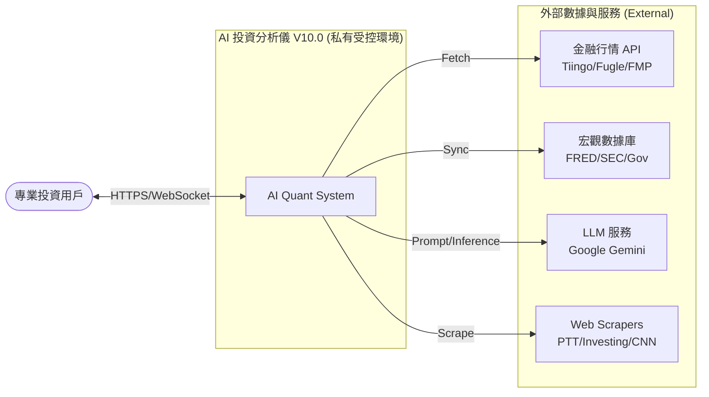

# 001_系統架構總覽與設計原則

**文件編號**：ARCH-V10.0-001
**版本**：2.0.0
**建立日期**：2026-01-20
**功能說明**：本文件為整個 AI 投資分析儀 V10.0 專案的頂層架構藍圖，詳細描述系統的設計決策、技術選型理由、各層級組件職責以及資訊安全原則。

---

## 1. 系統願景與設計哲學 (Vision & Philosophy)

AI 投資分析儀 V10.0 的核心使命是打造一個**「高隱私、高效能、可解釋」**的個人私有化智能投資中心。

### 1.1 從 V9.2 到 V10.0 的戰略轉移
*   **基礎設施轉型**：從公有雲 (Heroku/Render) 轉向**私有化部署 (Self-Hosted Supabase on QNAP NAS)**。
*   **技術棧統一**：棄用分散的微服務框架，統一採用 Supabase 體系處理認證、資料庫、即時推送與文件存儲。
*   **數據主權極致化**：所有個人資產、交易日誌與 AI 訓練基因 100% 儲存於本地加密磁碟區。
*   **智能引擎升級**：引入 RAG (檢索增強生成) 與演化策略模型，從「單純數據顯示」進化為「具備邏輯推導的策略建議」。

### 1.2 核心設計原則 (Guiding Principles)
1.  **KISS (Keep It Simple, Stupid)**：優先使用 Supabase 內建功能與 PostgreSQL 原生能力，減少外部組件引入。
2.  **數據主權優先 (Data Sovereignty First)**：外部 API 僅作為數據輸入，系統內部狀態與用戶資產絕不外流。
3.  **邊緣運算優化 (Edge Optimized)**：針對 QNAP NAS (AMD V1500B) 的 CPU/RAM 限制進行優化，大量使用非同步處理與快取。
4.  **雙環境開發相容 (Dual-Env Strategy)**：確保系統能流暢運行於開發筆電 (MSI Windows) 與生產 NAS (QNAP QuTS cloud)。

---

## 2. 系統架構總覽 (C4 Context & Container Map)

### 2.1 系統上下文圖 (C4 Context)
系統作為用戶的「投資大腦」，與多個外部數據源交互，並在本地完成所有分析。



### 2.2 容器架構圖 (Container Map)
系統由 Docker Compose 編排，將 Supabase 元件與自定義 AI Worker 無縫整合。

```mermaid
graph TB
    subgraph "接入層 (Gateway Layer)"
        Kong[Kong API Gateway<br/>路由/CORS/Auth]
    end

    subgraph "應用層 (Application Layer)"
        Web[Next.js Client<br/>Dashboard/Charts]
        Worker[AI Worker (Python)<br/>ETL/Quant/AI]
    end

    subgraph "服務層 (BaaS Services)"
        GoTrue[GoTrue<br/>身份認證]
        PostgREST[PostgREST<br/>RESTful API]
        Realtime[Realtime<br/>即時推送]
        Storage[Storage API<br/>文件存儲]
    end

    subgraph "存儲層 (Persistence Layer)"
        DB[(PostgreSQL 15<br/>pgvector/pg_cron)]
        Redis[(Redis<br/>系統快取/Queue)]
    end

    %% Interactions
    Web -->|HTTP| Kong
    Kong --> PostgREST
    Kong --> GoTrue
    Kong --> Storage
    
    Worker -->|SDK| DB
    Worker -->|Inference| AI_Service[Gemini API]
    
    DB <-->|WAL| Realtime
    Realtime -.->|WS| Web
    PostgREST <--> DB
```

---

## 3. 容器編排與自託管組件規格 (Container Architecture)

系統透過 Docker Compose 統籌管理 **Self-Hosted Supabase** 體系及自定義 AI Worker。本章節詳細說明各組件之技術配置與核心職責。

### 3.1 基礎設施組態 (Infrastructure Stack)

#### **Kong (API Gateway)**
*   **技術實現**：自託管 Kong 閘道器，監聽埠口：8000 (HTTP) / 8443 (HTTPS)。
*   **職責**：全系統唯一入口，負責 API 路由分發、跨域資源共享 (CORS) 政策管理、以及初步的 API Key 認證過濾。
*   **整合價值**：隱藏內部拓撲結構，確保內部微服務僅對網關開放，強化系統安全性。

#### **PostgreSQL (The Single Source of Truth)**
*   **技術實現**：PostgreSQL 15，核心插件包含：
    *   `pgvector`：基礎向量檢索支援，負責個股報告與輿情之語義搜索。
    *   `pg_cron`：資料庫層級的自動化維護任務（如定期備份或日誌清理）。
    *   `pg_net`：允許資料庫透過 Webhook 非同步觸發外部事件（如 Telegram 告警）。
*   **職責**：儲存所有結構化業務數據、用戶身份資料 (auth.users)、以及 RLS 安全原則之執行。

### 3.2 Supabase 核心服務層 (BaaS Services)

#### **GoTrue (Identity & Auth)**
*   **技術實現**：Netlify 開源之認證引擎。
*   **職責**：管理用戶註冊、登入與 JWT (JSON Web Token) 簽發。它是系統 RLS 安全模型的基石，確保用戶請求攜帶正確的 `user_id` 上下文。

#### **PostgREST (Data-as-a-Service)**
*   **技術實現**：自動 API 生成引擎。
*   **職責**：將 PostgreSQL Schema 直接映射為高效能的 RESTful API。
*   **整合價值**：前端 Dashboard 可跳過後端轉發，直接透過 SDK 進行極速 CRUD 操作，符合 KISS 原則。

#### **Realtime (Real-time Broadcast)**
*   **技術實現**：監聽 Postgres WAL (Write Ahead Log) 之 Elixir 服務。
*   **職責**：當行情數據 (`daily_price`) 或系統狀態更新時，透過 WebSocket 即時推送至前端。
*   **整合價值**：實現行情跳動與 AI 分析進度條之即時回饋，無須前端頻繁輪詢。

#### **Storage API (Object Storage)**
*   **技術實現**：兼容 S3 協議之文件管理 API。
*   **職責**：管理非結構化資源，如用戶頭像、AI 生成的 PDF 投資報告、及其預覽圖。

### 3.3 AI 智能運算層 (Execution Layer)

#### **AI Worker (Custom Container)**
*   **技術實現**：Python 3.11 環境。
*   **整合方式**：透過 **Supabase Python SDK** 與後端進行異步通訊。
*   **職責**：處理 Supabase 預設能力之外的重負載或複雜邏輯：
    *   **ETL 引擎**：向外部 API (Tiingo/FRED) 抓取數據並 Upsert 至資料庫。
    *   **Quant 分析**：執行演化策略模型 (Genetic Algorithm) 與量化因子演算。
    *   **LLM 整合**：封裝 LangChain 與 Google Gemini API，執行報告生成、數據推演。

---

## 4. 設計決策與實現路徑 (Technical Strategy)

### 4.1 為何選擇 Self-Hosted Supabase？
*   **零外部依賴**：100% 運行於 QNAP NAS 內部網路，無需依賴 Supabase Cloud。
*   **縮短開發週期**：將 Auth/DB/Storage 等 80% 的繁瑣工程交給 Supabase 處理，團隊專注於 20% 的硬核 AI 策略開法。
*   **SQL 為核心**：PostgreSQL 是金融數據處理的業界標準，便於數據遷移與專業分析。

### 4.2 存儲卷分層映射 (Multi-tier Storage)
針對 NAS 硬體特性，我們實施以下精確掛載：

| 儲存層 | 物理設備 | 子服務 | 配置理由 |
| :--- | :--- | :--- | :--- |
| **Hot (NVMe SSD)** | RAID 1 | `db`, `redis` | 確保資料庫事務與 WAL 寫入低延遲 |
| **Warm (SATA SSD)** | RAID 1 | `storage`, `logs` | 均衡檔案存取效能與儲存成本 |
| **Cold (HDD)** | RAID 1 | `backups` | 存放歷史行情備份與長期存檔 |

---

## 5. 數據採集與處理策略 (Data Strategy)

系統採用「混合式數據獲取 (Hybrid Data Acquisition)」：
1.  **商業優先**：對於 K 線與財報，優先使用 Tiingo/FMP API 以確保數據質量。
2.  **官方權威**：宏觀指標 (FRED) 與台股官方數據 (TWSE) 直接對接官方 OpenAPI。
3.  **爬蟲補足**：針對社群輿情 (PTT) 與特定市場情緒 (CNN Fear & Greed)，在 `ai-worker` 中利用 Stealth Mode Scraper 進行採集。

---

## 6. 技術棧清單 (Technical Stack Summary)

*   **後端之腦 (Logic)**：Python 3.11 (LangChain, Pandas, DEAP)。
*   **持久化之源 (DB)**：PostgreSQL 15 (向量存儲採 `pgvector`)。
*   **通訊代理 (API)**：PostgREST (Auto-API) + Realtime (WebSocket)。
*   **前端之窗 (UI)**：Next.js 14 (App Router) + Tailwind CSS (優雅、現代、極簡)。
*   **排程大腦 (Scheduler)**：Prefect (具備視圖的流程自動化管理)。

---

## 7. 結論 (Conclusion)

AI 投資分析儀 V10.0 的架構設計旨在消弭「雲端黑箱」帶來的不透明性。透過將 Supabase 自託管於 NAS，我們在保留開發便捷性 (FastAPI-like DX) 的同時，獲得了工業級的數據安全性。這是一套專為對資產隱私與分析深度有極致追求的投資人所準備的現代化架構體系。

---

**文件結束**
164: 
165: 

