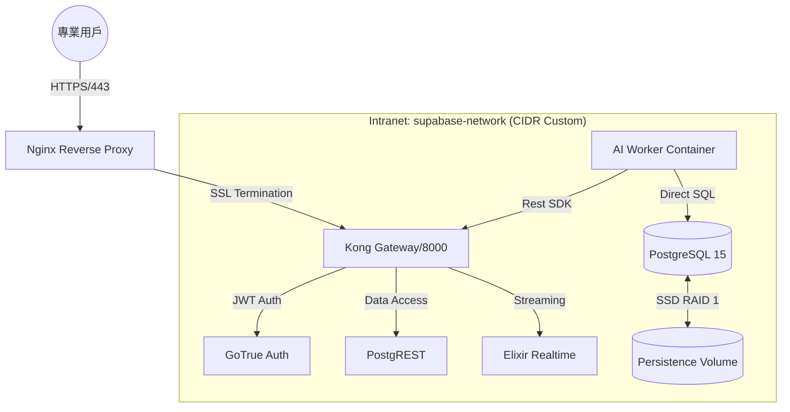

# 002_Docker Compose 編排規格與網路架構

**文件編號**：INFRA-V10.0-001
**版本**：3.0.0
**建立日期**：2026-02-25
**總體原則**：基於 QNAP TS-h973AX 硬體特性，實施「低延遲、高隔離、分層存儲」的容器化部署。

---

## 1. 系統編排總覽 (Orchestration Matrix)

本系統採用 **Self-Hosted Supabase** 架構，在 QNAP NAS 上透過 Docker Compose 建立封閉式的後端服務雲。

### 1.1 服務相依與數據流

---

## 2. 容器詳細組態規格

| 容器名稱 | 映像檔 (Image) | CPU 限制 | RAM 限制 | 職責與效能定位 |
| :--- | :--- | :--- | :--- | :--- |
| **supabase-db** | `supabase/postgres:15.1` | 4.0 Core | 8GB | 核心運算主體。掛載於 NVMe SSD (RAID 1) |
| **supabase-kong** | `kong:2.8.1-alpine` | 1.0 Core | 512MB | 流量閘道。處理 CORS 與身份驗證過濾 |
| **ai-worker** | `ai-quant-worker:latest` | 4.0 Core | 12GB | 遺傳演算法、ETL 重負載。支援 Python 異步 IO |
| **supabase-auth** | `supabase/gotrue:v2.13` | 1.0 Core | 512MB | 身份令牌管理。支援 RLS 安全模型基礎 |
| **frontend** | `quant-frontend:latest` | 1.0 Core | 1GB | Next.js SSR 環境。渲染 Dashboards |

---

## 3. 網路架構與安全隔離 (Networking)

### 3.1 邊界防火牆策略
*   **外部暴露**: 僅暴露 `Nginx (443)`。
*   **內部存取**: Supabase 內部服務 (GoTrue, PostgREST) 僅允許透過 `Kong` 流量互訪。
*   **管理通道**: Supabase Studio (8000) 僅限本地或授權 VPN IP 存取。

### 3.2 網路協議規範
*   **REST API**: HTTP/1.1 over Kong.
*   **Realtime**: WebSocket (WSS) 帶心跳機制。
*   **DB Stream**: Logical Decoding (WAL) 傳輸至 Realtime 容器。

---

## 4. 存儲卷分層掛載規格 (Storage Hierarchy)

依據【憲級文件 2.2】，實施物理級別的路徑掛載，以發揮 NAS 最大效能：

| 掛載點 (Container Path) | 宿主機物理路徑 (QNAP Path) | 儲存類別 | 配置原因 |
| :--- | :--- | :--- | :--- |
| `/var/lib/postgresql/data` | `/share/NVMe_RAID1/db_data` | **Hot** | NVMe SSD 確保高併發交易與向量搜尋速度 |
| `/var/lib/storage` | `/share/SATA_SSD_RAID1/files` | **Warm** | SATA SSD 儲存 AI 報告與常用快照檔案 |
| `/backups` | `/share/HDD_RAID1/automated_backups` | **Cold** | HDD 提供大容量歷史行情歸檔與備份 |

---

## 5. 生命週期管理

1.  **啟動順序**: `db` -> `auth` -> `rest` -> `kong` -> `ai-worker` -> `frontend`。
2.  **健康檢查 (Healthcheck)**: 每個服務皆具備 `/health` 探針，當 CPU 持續 100% 超過 5 分鐘自動執行容器重啟計畫。
3.  **日誌聚合**: 透過 Docker JSON-file driver 記錄，並由 `pg_cron` 定期彙總至 `system_logs` 表。

---
**文件結束**
