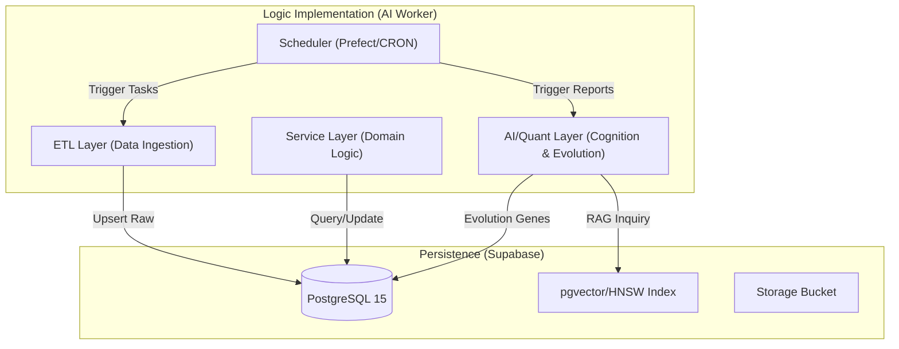

# 003_功能模組詳細設計規格 (AI Worker Logic)

**文件編號**：ARCH-V10.0-003
**版本**：2.0.0
**建立日期**：2026-01-20
**功能說明**：本文件定義了 AI 投資分析儀 V10.0 核心功能模組的詳細設計，包含類別結構、方法簽章、數據流與實作邏輯。此文件為 `ai-worker` 容器開發的最高準則，確保程式邏輯與「憲級文件」及「資料庫 Schema (004)」高度對齊。

---

## 1. 模組架構總覽 (Architecture Hierarchy)

系統採用「分層職責 (Layered Responsibility)」架構，確保邏輯解耦且易於測試。



---

## 2. 核心功能模組清單 (Functional Module Details)

### 2.1 核心模組 (Core Modules)

#### MD. 市場行情與總經模組 (Market & Macro Data)
**模組編號**：MOD-MD-001
| 功能項目 | 說明 | 技術實現 | 對應表 |
| :--- | :--- | :--- | :--- |
| **多源數據擷取** | 整合 Tiingo, Fugle, FRED, TWSE | `BaseFetcher` 體系 | `daily_price`, `macro_indicators` |
| **品質監控** | 自動偵測數據缺漏與邏輯校驗 | `DataQualityMonitor` | `error_logs` |
| **衍生指標計算** | MA, MACD, 10Y-2Y 總經因子 | Pandas TA / NumPy | `stock_factors` |

#### ES. 演化策略與量化引擎 (Evolution & Quant)
**模組編號**：MOD-ES-001
| 功能項目 | 說明 | 技術實現 | 對應表 |
| :--- | :--- | :--- | :--- |
| **量化因子評分** | 價值、成長、品質、動能維度評分 | `FactorService` | `stock_factors` |
| **演化策略優化** | 透過遺傳演算法優化 26 項權重基因 | DEAP Framework | `evolution_genes` |
| **策略回測引擎** | 依據演化權重執行歷史回測與評鑑 | `BacktestEngine` | `backtest_results` |

#### AA. AI 智能分析與 RAG (AI Analysis & RAG)
**模組編號**：MOD-AA-001
| 功能項目 | 說明 | 技術實現 | 對應表 |
| :--- | :--- | :--- | :--- |
| **智能報告生成** | 製作個股與總經 PPT/MD 報告 | Gemini 1.5 Flash | `ai_reports` |
| **知識向量化** | 支援自然語言語意搜尋與檢索 | `pgvector` + HNSW | `ai_reports.embedding` |
| **情緒雷達** | 解析 PTT/CNN 數據並與 AI 校準 | Gemini NLP Scraper | `sentiment_data` |

#### UT. 用戶資產與帳務日誌 (User Assets & Transactions)
**模組編號**：MOD-UT-001
| 功能項目 | 說明 | 技術實現 | 對應表 |
| :--- | :--- | :--- | :--- |
| **持倉/損益監控** | 追蹤即時市值、成本與累計損益 | PostgreSQL Views | `portfolios` |
| **帳務日誌 (TR)** | 詳細紀錄每一筆交易稅費明細 | `TransactionStore` | `transaction_logs` |
| **隱私隔離** | 透過 RLS 確保資產數據本地隔離 | Supabase Auth/RLS | `portfolios` |

---

## 3. ETL Layer (數據擷取層) 詳細設計

### 3.1 模組結構
`backend/etl/` 目錄結構包含 `market/`, `macro/`, `sentiment/` 等子目錄，確保擷取邏輯與外部來源解耦。

### 3.2 抽象基底類別 `BaseFetcher`
```python
# backend/etl/base_fetcher.py
class BaseFetcher(ABC):
    def __init__(self, db: Client, table_name: str):
        self.db = db
        self.table_name = table_name

    @abstractmethod
    def fetch(self, **kwargs) -> list[dict]: pass

    @abstractmethod
    def transform(self, raw_data: list[dict]) -> list[dict]: pass

    def load(self, records: list[dict]) -> int:
        """批量 Upsert 到 Supabase 確保資料一致性。"""
        if not records: return 0
        return len(self.db.table(self.table_name).upsert(records).execute().data)

    def run(self, **kwargs) -> int:
        return self.load(self.transform(self.fetch(**kwargs)))
```

### 3.3 API 金鑰池 `ApiKeyPool`
支援多金鑰輪詢 (Round-Robin)，繞過外部 API (如 Tiingo/Gemini) 的頻率限制。

---

## 4. Service Layer (商業邏輯層) 詳細設計

### 4.1 量化因子計算 (`FactorService`)
*   **計算邏輯**: 讀取 `market_data` -> 計算指標 -> 正規化分數 (0-100) -> 依權重綜合成 Composite Score。
*   **方法**: `calculate_value_score()`, `calculate_momentum_score()`。

### 4.2 交易戰術監控 (`TacticalMonitor`) (MOD-SM-001)
*   **核心邏輯**: 循環檢索 `tactical_plans` 中 `status='ACTIVE'` 的計畫。
*   **觸發條件**: 若 Price >= `profit_target` 或 Price <= `stop_loss_limit`。
*   **通知機制**: 觸發後呼叫 `NotificationService` 進行多端推送。

---

## 5. AI/Quant Layer (智能分析層) 詳細設計

### 5.1 演化策略引擎 (`EvolutionEngine`)
*   **演化演算法**: 基於遺傳演算法 (Genetic Algorithm)，對 26 項核心基因進行選擇、交叉與變異。
*   **適應度評估**: 呼叫 `BacktestEngine` 獲取 Sharpe Ratio 與年度報酬率。
*   **成果儲存**: 勝出基因組存入 `evolution_genes` 表，供 `ReportGenerator` 調用。

### 5.2 智能報告生成 (`ReportGenerator`)
*   **分析框架**: 結合量化評分 (Quant Score) 與 AI 資料分析。
*   **工作流**: 收集標的數據 -> 讀取最佳權重 -> 構建上下文 Prompt -> 呼叫 Gemini -> 生成報告並存儲。

### 5.3 情境模擬與試算 (`ScenarioAnalyzer`) (MOD-SN-001)
*   **壓力測試**: 模擬歷史極端行情 (例如：2008金融海嘯、2020三月熔斷)。
*   **變數調節**: 使用者可手動調節「假設性變數」(如美元指數+5%、利率+1碼)，AI 即時預估損益影響。

---

## 6. Scheduler Layer (排程引擎層) 設計

採用 **Prefect** 框架，透過 `prefact.yaml` 定義部署，並由 `ai-worker` 的後端線程執行。

| 任務名稱 | 頻率 (Cron) | 目標 |
| :--- | :--- | :--- |
| 市場同步 | `0 18 * * 1-5` | 更新台股行情 |
| 美股同步 | `0 06 * * 2-6` | 更新美股行情 (夏令) |
| 基因演化 | `0 21 * * 1-5` | 尋找最佳投資權重 |
| AI 報告產出 | `0 08 * * 1-5` | 每日開盤前分析 |

---

## 7. 數據流與錯誤處理 (Resilience)

### 7.1 跨層數據流 (Data Pipeline)
1. **擷取**: `ETL` -> `daily_price`
2. **加工**: `Service` -> `stock_factors`
3. **優化**: `AI/Quant` -> `evolution_genes`
4. **輸出**: `AA` -> `ai_reports`

### 7.2 錯誤處理原則 (Retry & Fallback)
*   **傳輸重試**: 使用 `tenacity` 實現帶退避機制的 API 請求重試。
*   **狀態稽核**: 每日清晨 03:00 自動稽核 `Backfill` 缺漏區段並啟動補洞程序。
*   **隔離寫入**: 所有寫入 `transaction_logs` 的操作必須在交易 (Transaction) 內執行，確保資產計算數值一致性。

---

## 8. 驗證策略 (Testing)
*   **邏輯驗證**: 每個 Service 方法具備 90% 以上 Unit Test 覆蓋率。
*   **回測驗證**: 演化出的基因組必須通過「樣本外測試 (Out-of-sample Testing)」方可標記為可用基因。

---
**文件結束**
