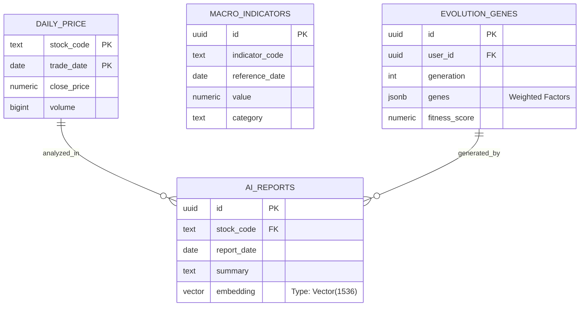

# 004_資料庫實體關係圖與 Schema 定義

**文件編號**：DB-V10.0-001
**版本**：2.0.0
**建立日期**：2026-02-25
**依據**：`AI 投資分析儀 V10.0 的完整可執行程式碼.md` (Section 2.1)

---

## 1. 實體關係圖 (ER Diagram)

本系統資料庫設計圍繞「行情」、「宏觀」、「決策」三大核心領域。



---

## 2. 詳細 Schema 定義

### 2.1 行情數據 (`daily_price`)
*   **用途**: 儲存台股、美股之 OHLCV 歷史行情。
*   **分區策略**: 建議依 `trade_date` 按年分區 (Partition by Range) 以優化查詢效能。
*   **索引**: `(stock_code, trade_date)` 複合主鍵。

### 2.2 宏觀指標 (`macro_indicators`)
*   **用途**: 儲存 FRED、台灣央行之經濟數據。
*   **特點**: `indicator_code` 統一使用 FRED 代碼 (如 `GDP`, `CPIAUCSL`)。
*   **唯一性**: `UNIQUE(indicator_code, reference_date)` 防止重複匯入。

### 2.3 AI 分析報告 (`ai_reports`)
*   **用途**: 儲存 Gemini 生成的文字報告與 RAG 用向量。
*   **向量欄位**: `embedding vector(1536)` 對應 Gemini Embedding 模型維度。
*   **索引**: 使用 `hnsw` 索引加速餘弦相似度 (Cosine Similarity) 搜尋。

### 2.4 演化基因組 (`evolution_genes`)
*   **用途**: 儲存遺傳演算法優化後的策略參數。
*   **RLS 保護**:
    *   `SELECT`: 僅限擁有者 (`auth.uid() = user_id`)。
    *   `INSERT`: 僅限擁有者或系統服務角色 (`service_role`)。
*   **JSONB 結構**:
    ```json
    {
      "weight_value": 0.3,
      "weight_growth": 0.4,
      "weight_momentum": 0.2,
      "stop_loss_pct": 0.05
    }
    ```

---

## 3. 擴充套件 (Extensions)

系統依賴以下 PostgreSQL Extensions：
1.  **`vector`**: 支援 AI 高維向量儲存與運算。
2.  **`pg_cron`**: 支援資料庫內的定時任務 (如每晚彙總)。
3.  **`moddatetime`**: 自動維護 `updated_at` 欄位。

---
**文件結束**
