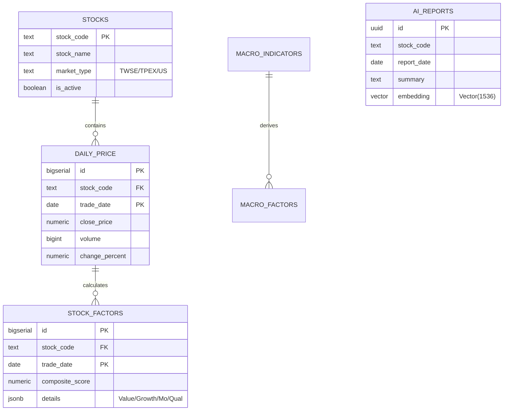

# 004_資料庫實體關係圖與 Schema 定義

**文件編號**：DB-V10.0-001
**版本**：3.0.0
**建立日期**：2026-02-25
**核心理念**：以「單一事實來源 (SSOT)」為核心，支撐 500 萬級數據量之即時檢索與量化分析。

---

## 1. 實體關係圖 (ERD)

---

## 2. 詳細資料表定義 (Table Specs)

### 2.1 行情底座表 (`daily_price`)
*   **用途**：標準 OHLCV 行情儲存。
*   **物理分區建議**：依 `trade_date` 進行年度 Partition (於 V11 實作，現階段採 Index 優化)。
*   **索引優化**：
    - `idx_daily_price_composite`: `(stock_code, trade_date DESC)`。
    - `idx_daily_price_date`: `(trade_date DESC)`。

### 2.2 宏觀經濟表 (`macro_indicators`)
*   **用途**：FRED / IMF 全球指標基準數據。
*   **欄位增修**：
    - `transformation_type`: 記錄數據狀態（原值/YoY/%Change）。
    - `retrieved_at`: 資料爬取時間戳，用於稽核。
    - `reference_date`: 資料對應月份/季度的第一天。

### 2.3 量化因子表 (`stock_factors`) [CRITICAL]
*   **用途**：儲存多維度量化評分，為 AI 引擎之「燃料」。
*   **欄位規格**：
    - `value_score`: (0-100) 基於 PE/PB。
    - `momentum_score`: (0-100) 基於 20D/60D 價格強度。
    - `quality_score`: (0-100) 基於 ROE/利潤率。
    - `growth_score`: (0-100) 基於營收/EPS 年增。
    - `composite_score`: 根據 `evolution_genes` 調配出的綜合分數。

### 2.4 AI 分析報告 (`ai_reports`)
*   **用途**：儲存 LLM 生成結果與檢索索引。
*   **欄位規格**：
    - `context_snapshot`: (JSONB) 紀錄生成報告時的關鍵數據快照，方便回溯 AI 「為何這樣說」。
    - `embedding`: 預設採 `text-embedding-3-small` (1536 維)。

---

## 3. 系統欄位與稽核機制 (Audit Fields)

每一張表必須包含以下系統維護欄位：
*   `created_at`: `timestamptz DEFAULT now()`。
*   `updated_at`: `timestamptz DEFAULT now()` (透過 `moddatetime` 觸發)。
*   `metadata`: `jsonb` 預留擴充彈性。

---

## 4. RLS 安全原則 (Row Level Security)

1.  **用戶數據 (`portfolios`, `evolution_genes`)**:
    - `USING (auth.uid() = user_id)`
2.  **公共數據 (`daily_price`, `macro_indicators`)**:
    - `SELECT`: `anon` 可讀。
    - `INSERT/UPDATE`: 僅限 `service_role` (AI Worker)。

---
**文件結束**
