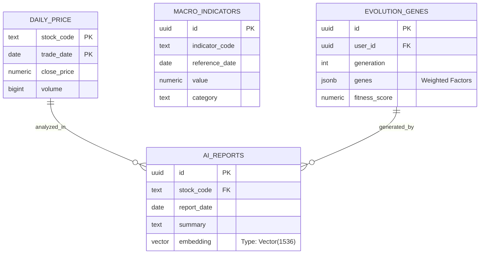

# 004_資料庫實體關係圖與 Schema 定義

**文件編號**：DB-V10.0-001
**版本**：2.0.0
**建立日期**：2026-02-25
**依據**：`AI 投資分析儀 V10.0 的完整可執行程式碼.md` (Section 2.1)

---

## 1. 實體關係圖 (ER Diagram)

本系統資料庫設計圍繞「行情」、「宏觀」、「決策」三大核心領域。

---

## 2. 詳細 Schema 定義

### 2.1 行情數據 (`daily_price`)
*   **用途**: 儲存台股、美股之 OHLCV 歷史行情。
*   **關鍵欄位**: `stock_code`, `market_type` (上市/上櫃), `trade_date`, `open_price`, `high_price`, `low_price`, `close_price`, `volume`, `turnover`, `change_percent`。
*   **索引**: `(stock_code, trade_date)` UNIQUE KEY；`idx_daily_price_date` 加速時間序列查詢。

### 2.2 宏觀指標 (`macro_indicators`)
*   **用途**: 儲存 FRED、台灣政府之 130+ 指標數據。
*   **詳細欄位**:
    - **識別**: `indicator_code`, `indicator_name`, `country`, `category`。
    - **數值**: `value`, `unit`, `transformation_type` (原值/YoY/MoM), `frequency` (D/W/M/Q)。
    - **元數據**: `source`, `retrieved_at`, `published_at`, `is_estimate`, `is_revised`。
*   **特點**: `UNIQUE(indicator_code, reference_date)` 確保時間序列唯一性。

### 2.3 多因子評分 (`stock_factors`)
*   **用途**: 儲存個股在價值、成長、品質、動能四個維度的量化分數。
*   **詳細欄位**: 
    - **價值**: `pe_ratio`, `pb_ratio`, `dividend_yield`。
    - **成長**: `revenue_growth`, `eps_growth`。
    - **動能**: `momentum_1m`, `relative_strength`。
    - **品質**: `roe`, `gross_margin`, `debt_to_equity`。
    - **綜合**: `composite_score` (由 AI 演化權重加權)。

### 2.4 AI 分析報告 (`ai_reports`)
*   **用途**: 儲存 Gemini 生成的文字報告與 RAG 用向量。
*   **欄位**: `stock_code`, `report_date`, `summary`, `full_content`, `embedding Vector(1536)`。
*   **索引**: `hnsw` 索引加速餘弦相似度 (Cosine Similarity) 搜尋。

### 2.5 演化基因組 (`evolution_genes`)
*   **用途**: 儲存遺傳演算法優化後的 26 項策略參數。
*   **結構**: `user_id` (RLS), `generation`, `genes` (JSONB), `fitness_score` (Sharpe Ratio)。

---

## 3. 擴充套件 (Extensions)

系統依賴以下 PostgreSQL Extensions：
1.  **`vector`**: 支援 AI 高維向量儲存與運算。
2.  **`pg_cron`**: 支援資料庫內的定時任務 (如每晚彙總)。
3.  **`moddatetime`**: 自動維護 `updated_at` 欄位。

---
**文件結束**
